# rentagents Design System

You are building UI for **rentagents**. Light-themed, cool palette, sans-serif typography (Inter), compact density on a 4px grid, expressive motion.

## Visual Reference

**IMPORTANT**: Study ALL screenshots below before writing any UI. Match colors, typography, spacing, layout, and motion exactly as shown.

### Homepage

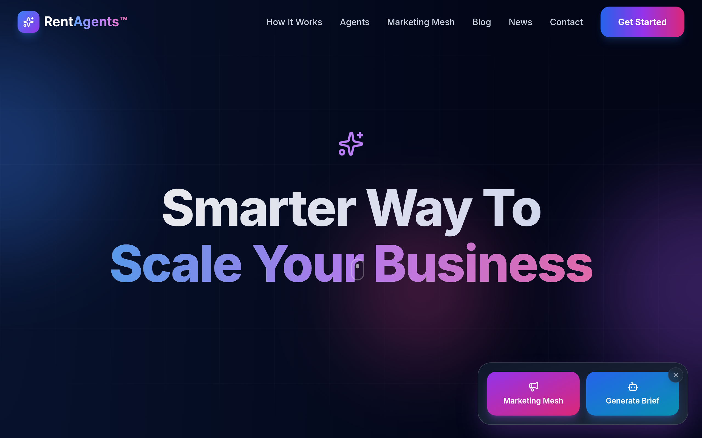

### Scroll Journey (Cinematic Visual States)

> These screenshots capture the website at different scroll depths. The design changes dramatically as you scroll — each frame shows a different cinematic state. Replicate these exact visual transitions.

#### 0% — Hero / Above the fold


#### 17% — Mid-page at 17% scroll

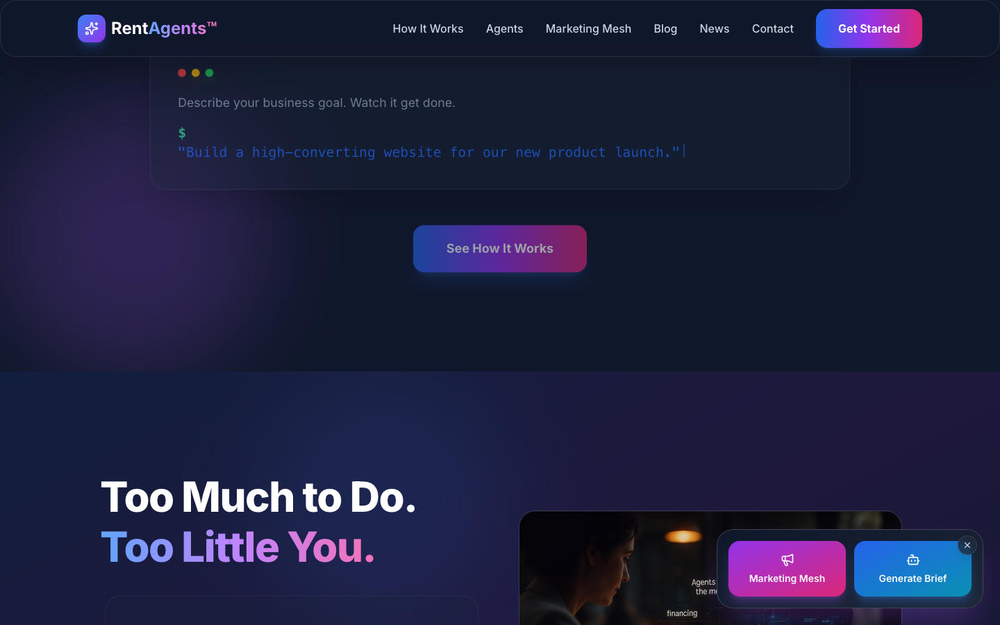

#### 33% — Mid-page at 33% scroll


#### 50% — Mid-page at 50% scroll

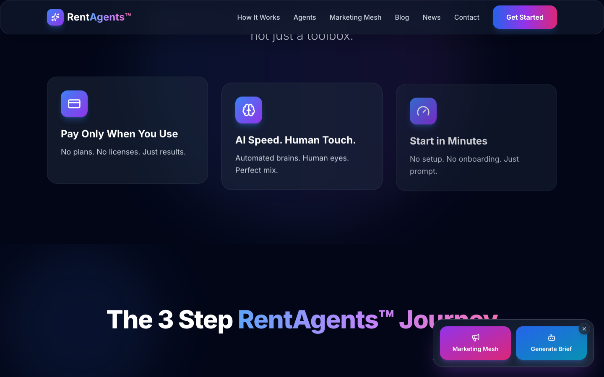

#### 67% — Mid-page at 67% scroll

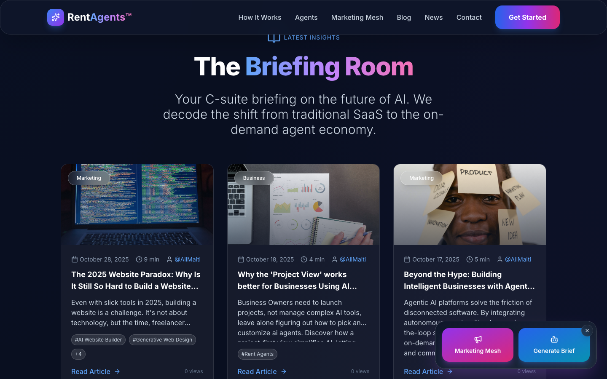

#### 83% — Mid-page at 83% scroll

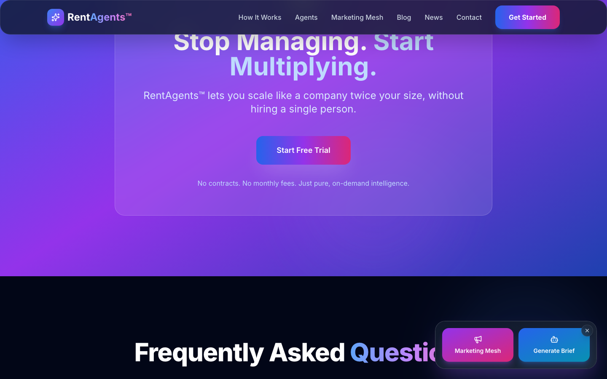

#### 100% — Footer / End of page

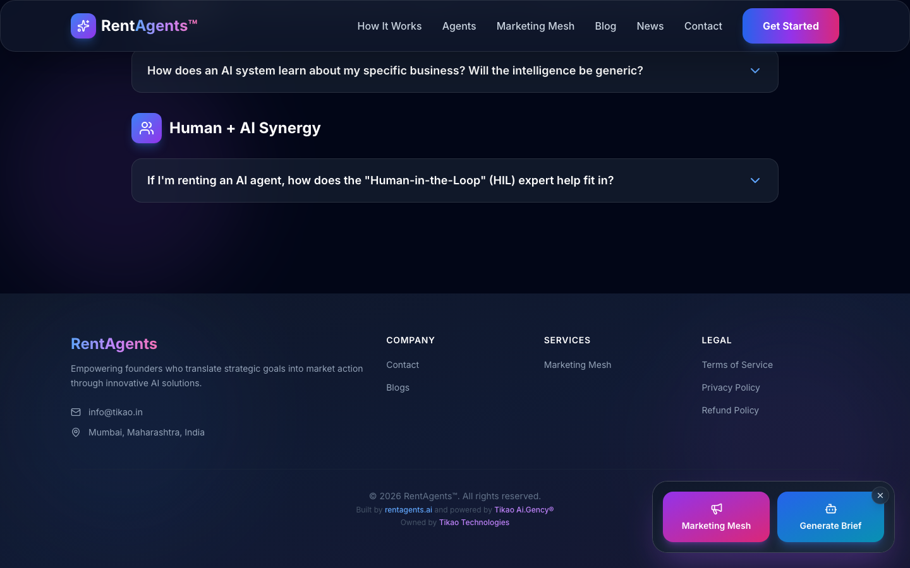

> Read `references/DESIGN.md` for full token details. Read `references/ANIMATIONS.md` for motion specs. Read `references/LAYOUT.md` for layout structure. Read `references/COMPONENTS.md` for component patterns.

## Ultra Reference Files

This package includes extended documentation. **Read these files before implementing:**

| File | Contents |
|------|----------|
| `references/DESIGN.md` | Full design system tokens, colors, typography, spacing |
| `references/VISUAL_GUIDE.md` | **START HERE** — Master visual guide with all screenshots embedded |
| `references/ANIMATIONS.md` | CSS keyframes, scroll triggers, motion library stack, video specs |
| `references/LAYOUT.md` | Flex/grid containers, page structure, spacing relationships |
| `references/COMPONENTS.md` | DOM component patterns, HTML structure, class fingerprints |
| `references/INTERACTIONS.md` | Hover/focus states with before/after style diffs |
| `screens/scroll/` | 7 scroll journey screenshots showing cinematic states |

### Animation Stack Detected

- **Web Animations API (9 active)** — animation

## Design Philosophy

- **Layered depth** — use shadow tokens to create a sense of physical layering. Each elevation level has a specific shadow.
- **Gradient accents** — gradients are used thoughtfully for emphasis, not decoration.
- **Single typeface** — Inter carries all text. Hierarchy comes from size, weight, and color — never font mixing.
- **compact density** — 4px base grid. Every dimension is a multiple of 4.
- **cool palette** — the color temperature runs cool, matching the sans-serif typography.
- **Restrained accent** — `#93c5fd` is the only pop of color. Used exclusively for CTAs, links, focus rings, and active states.
- **Expressive motion** — animations are an integral part of the experience. Use spring physics and layout animations.

## Color System

### Core Palette

| Role | Token | Hex | Use |
|------|-------|-----|-----|
| Background | `--background` | `#ffffff` | Page/app background |
| Text Primary | `--text-primary` | `#1e293b` | Headings, body text |
| Text Muted | `--text-muted` | `#9ca3af` | Captions, placeholders |
| Accent | `--accent` | `#93c5fd` | CTAs, links, focus rings |
| Border | `--border` | `#475569` | Dividers, card borders |

### Status Colors

| Status | Hex | Use |
|--------|-----|-----|
| Success | `#34d399` | Confirmations, positive trends |
| Danger | `#ec4899` | Errors, destructive actions |

### Extended Palette

- `#e5e7eb` — Light surface or highlight color
- `#cbd5e1`
- `#60a5fa`
- `#334155`
- `#64748b`
- `#a855f7`
- `#c084fc`
- `#3b82f6`

## Typography

### Font Stack

- **Inter** — Heading 1, Heading 2, Heading 3, Body, Caption
- **SFMono-Regular** — Code

### Type Scale

| Role | Family | Size | Weight |
|------|--------|------|--------|
| Heading 1 | Inter | 6rem | 700 |
| Heading 2 | Inter | 4.5rem | 700 |
| Heading 3 | Inter | 3.75rem | 700 |
| Body | Inter | 1.125rem | 400 |
| Caption | Inter | 1.25rem | 400 |
| Code | SFMono-Regular | 14px | 400 |

### Typography Rules

- All text uses **Inter** — never add another font family
- Max 3-4 font sizes per screen
- Headings: weight 600-700, body: weight 400
- Use color and opacity for text hierarchy, not additional font sizes
- Line height: 1.5 for body, 1.2 for headings

## Spacing & Layout

### Base Grid: 4px

Every dimension (margin, padding, gap, width, height) must be a multiple of **4px**.

### Spacing Scale

`2, 4, 8, 12, 14, 16, 20, 24, 32, 36, 40, 48` px

### Spacing as Meaning

| Spacing | Use |
|---------|-----|
| 4-8px | Tight: related items (icon + label, avatar + name) |
| 12-16px | Medium: between groups within a section |
| 24-32px | Wide: between distinct sections |
| 48px+ | Vast: major page section breaks |

### Border Radius

Scale: `.25rem, .5rem, .75rem, 1rem, 1.5rem, 8px, 12px, 16px, 24px`
Default: `1.5rem`

### Container

Max-width: `80rem`, centered with auto margins.

### Breakpoints

| Name | Value |
|------|-------|
| sm | 640px |
| md | 768px |
| lg | 1024px |
| xl | 1280px |

Mobile-first: design for small screens, layer on responsive overrides.

## Component Patterns

### Card

```css
.card {
  background: #ffffff;
  border: 1px solid #475569;
  border-radius: 1.5rem;
  padding: 16px;
  box-shadow: rgba(0, 0, 0, 0) 0px 0px 0px 0px, rgba(0, 0, 0, 0) 0px 0px 0px 0px, rgba(0, 0, 0, 0.1) 0px 10px 15px -3px, rgba(0, 0, 0, 0.1) 0px 4px 6px -4px;
}
```

```html
<div class="card">
  <h3>Card Title</h3>
  <p>Card content goes here.</p>
</div>
```

### Button

```css
/* Primary */
.btn-primary {
  background: #93c5fd;
  color: #1e293b;
  border-radius: 1.5rem;
  padding: 8px 16px;
  font-weight: 500;
  transition: opacity 150ms ease;
}
.btn-primary:hover { opacity: 0.9; }

/* Ghost */
.btn-ghost {
  background: transparent;
  border: 1px solid #475569;
  color: #1e293b;
  border-radius: 1.5rem;
  padding: 8px 16px;
}
```

```html
<button class="btn-primary">Get Started</button>
<button class="btn-ghost">Learn More</button>
```

### Input

```css
.input {
  background: #ffffff;
  border: 1px solid #475569;
  border-radius: 1.5rem;
  padding: 8px 12px;
  color: #1e293b;
  font-size: 14px;
}
.input:focus { border-color: #93c5fd; outline: none; }
```

```html
<input class="input" type="text" placeholder="Search..." />
```

### Badge / Chip

```css
.badge {
  display: inline-flex;
  align-items: center;
  padding: 4px 8px;
  border-radius: 9999px;
  font-size: 12px;
  font-weight: 500;
  background: #ffffff;
  color: #9ca3af;
}
```

```html
<span class="badge">New</span>
<span class="badge">Beta</span>
```

### Modal / Dialog

```css
.modal-backdrop { background: rgba(0, 0, 0, 0.6); }
.modal {
  background: #ffffff;
  border: 1px solid #475569;
  border-radius: 24px;
  padding: 24px;
  max-width: 480px;
  width: 90vw;
  box-shadow: rgba(0, 0, 0, 0) 0px 0px 0px 0px, rgba(0, 0, 0, 0) 0px 0px 0px 0px, rgba(0, 0, 0, 0.1) 0px 10px 15px -3px, rgba(0, 0, 0, 0.1) 0px 4px 6px -4px;
}
```

```html
<div class="modal-backdrop">
  <div class="modal">
    <h2>Dialog Title</h2>
    <p>Dialog content.</p>
    <button class="btn-primary">Confirm</button>
    <button class="btn-ghost">Cancel</button>
  </div>
</div>
```

### Table

```css
.table { width: 100%; border-collapse: collapse; }
.table th {
  text-align: left;
  padding: 8px 12px;
  font-weight: 500;
  font-size: 12px;
  color: #9ca3af;
  text-transform: uppercase;
  letter-spacing: 0.05em;
  border-bottom: 1px solid #475569;
}
.table td {
  padding: 12px;
  border-bottom: 1px solid #475569;
}
```

```html
<table class="table">
  <thead><tr><th>Name</th><th>Status</th><th>Date</th></tr></thead>
  <tbody>
    <tr><td>Item One</td><td>Active</td><td>Jan 1</td></tr>
    <tr><td>Item Two</td><td>Pending</td><td>Jan 2</td></tr>
  </tbody>
</table>
```

### Navigation

```css
.nav {
  display: flex;
  align-items: center;
  gap: 8px;
  padding: 12px 16px;
  border-bottom: 1px solid #475569;
}
.nav-link {
  color: #9ca3af;
  padding: 8px 12px;
  border-radius: 1.5rem;
  transition: color 150ms;
}
.nav-link:hover { color: #1e293b; }
.nav-link.active { color: #93c5fd; }
```

```html
<nav class="nav">
  <a href="/" class="nav-link active">Home</a>
  <a href="/about" class="nav-link">About</a>
  <a href="/pricing" class="nav-link">Pricing</a>
  <button class="btn-primary" style="margin-left: auto">Get Started</button>
</nav>
```

## Animation & Motion

This project uses **expressive motion**. Animations are part of the design language.

### CSS Animations

- `border-animation`
- `blob`
- `pulse`
- `spin`
- `float`

### Motion Tokens

- **Duration scale:** `.15s`, `.2s`, `.3s`, `.5s`
- **Easing functions:** `cubic-bezier(.4,0,.2,1)`

### Motion Guidelines

- **Duration:** Use values from the duration scale above. Short (.15s) for micro-interactions, long (.5s) for page transitions
- **Easing:** Use `cubic-bezier(.4,0,.2,1)` as the default easing curve
- **Direction:** Elements enter from bottom/right, exit to top/left
- **Reduced motion:** Always respect `prefers-reduced-motion` — disable animations when set

## Depth & Elevation

### Shadow Tokens

- Floating (dropdowns, popovers): `rgba(0, 0, 0, 0) 0px 0px 0px 0px, rgba(0, 0, 0, 0) 0px 0px 0px 0px, rgba(0, 0, 0, 0.1) 0px 10px 15px -3px, rgba(0, 0, 0, 0.1) 0px 4px 6px -4px`
- Floating (dropdowns, popovers): `rgba(0, 0, 0, 0) 0px 0px 0px 0px, rgba(0, 0, 0, 0) 0px 0px 0px 0px, rgba(59, 130, 246, 0.2) 0px 10px 15px -3px, rgba(59, 130, 246, 0.2) 0px 4px 6px -4px`
- Floating (dropdowns, popovers): `rgba(0, 0, 0, 0) 0px 0px 0px 0px, rgba(0, 0, 0, 0) 0px 0px 0px 0px, rgba(168, 85, 247, 0.3) 0px 10px 15px -3px, rgba(168, 85, 247, 0.3) 0px 4px 6px -4px`
- Floating (dropdowns, popovers): `rgba(0, 0, 0, 0) 0px 0px 0px 0px, rgba(0, 0, 0, 0) 0px 0px 0px 0px, rgba(59, 130, 246, 0.3) 0px 10px 15px -3px, rgba(59, 130, 246, 0.3) 0px 4px 6px -4px`
- Floating (dropdowns, popovers): `rgba(0, 0, 0, 0) 0px 0px 0px 0px, rgba(0, 0, 0, 0) 0px 0px 0px 0px, rgba(239, 68, 68, 0.5) 0px 10px 15px -3px, rgba(239, 68, 68, 0.5) 0px 4px 6px -4px`
- Floating (dropdowns, popovers): `rgba(0, 0, 0, 0) 0px 0px 0px 0px, rgba(0, 0, 0, 0) 0px 0px 0px 0px, rgba(234, 179, 8, 0.5) 0px 10px 15px -3px, rgba(234, 179, 8, 0.5) 0px 4px 6px -4px`

### Z-Index Scale

`10, 50`

Use these exact values — never invent z-index values.

## Anti-Patterns (Never Do)

- **No blur effects** — no backdrop-blur, no filter: blur()
- **No zebra striping** — tables and lists use borders for separation
- **No invented colors** — every hex value must come from the palette above
- **No arbitrary spacing** — every dimension is a multiple of 4px
- **No extra fonts** — only Inter and SFMono-Regular are allowed
- **No arbitrary border-radius** — use the scale: .25rem, .5rem, .75rem, 1rem, 1.5rem, 8px, 12px, 16px, 24px
- **No opacity for disabled states** — use muted colors instead

## Workflow

1. **Read** `references/DESIGN.md` before writing any UI code
2. **Pick colors** from the Color System section — never invent new ones
3. **Set typography** — Inter, SFMono-Regular only, using the type scale
4. **Build layout** on the 4px grid — check every margin, padding, gap
5. **Match components** to patterns above before creating new ones
6. **Apply elevation** — use shadow tokens
7. **Validate** — every value traces back to a design token. No magic numbers.

## Brand Spec

- **Favicon:** `/vite.svg`
- **Site URL:** `https://rentagents.ai/`
- **Brand color:** `#93c5fd`
- **Brand typeface:** Inter

## Quick Reference

```
Background:     #ffffff
Surface:        (not extracted)
Text:           #1e293b / #9ca3af
Accent:         #93c5fd
Border:         #475569
Font:           Inter
Spacing:        4px grid
Radius:         1.5rem
Components:     0 detected
```

## When to Trigger

Activate this skill when:
- Creating new components, pages, or visual elements for rentagents
- Writing CSS, Tailwind classes, styled-components, or inline styles
- Building page layouts, templates, or responsive designs
- Reviewing UI code for design consistency
- The user mentions "rentagents" design, style, UI, or theme
- Generating mockups, wireframes, or visual prototypes

---

# Full Reference Files

> Every output file is embedded below. Claude has full design system context from /skills alone.

## Design System Tokens (DESIGN.md)

# rentagents DESIGN.md

> Auto-generated design system — reverse-engineered via static analysis by skillui.
> Frameworks: None detected
> Colors: 20 · Fonts: 2 · Components: 0
> Icon library: not detected · State: not detected
> Primary theme: light · Dark mode toggle: no · Motion: expressive

## Visual Reference

**Match this design exactly** — study colors, fonts, spacing, and component shapes before writing any UI code.


---

## 1. Visual Theme & Atmosphere

This is a **light-themed** interface with a cool, approachable feel. The light background emphasizes content clarity. Typography uses **Inter** throughout — a clean, modern choice that maintains consistency. Spacing follows a **4px base grid** (compact density), with scale: 2, 4, 8, 12, 14, 16, 20, 24px. The accent color **#93c5fd** anchors interactive elements (buttons, links, focus rings). Motion is expressive — spring physics, layout animations, and staggered reveals are part of the visual language.

---

## 2. Color Palette & Roles

| Token | Hex | Role | Use |
|---|---|---|---|
| tw-ring-offset-color | `#ffffff` | background | Page background, darkest surface |
| text-primary | `#1e293b` | text-primary | Headings and body text |
| text-muted | `#9ca3af` | text-muted | Captions, placeholders, secondary info |
| border | `#475569` | border | Dividers, card borders, outlines |
| accent | `#93c5fd` | accent | CTAs, links, focus rings, active states |
| danger | `#ec4899` | danger | Error states, destructive actions |
| success | `#34d399` | success | Success states, positive indicators |
| info | `#60a5fa` | info | Informational highlights |
| unknown | `#e5e7eb` | unknown | Palette color |
| unknown | `#cbd5e1` | unknown | Palette color |
| unknown | `#334155` | unknown | Palette color |
| unknown | `#64748b` | unknown | Palette color |
| unknown | `#a855f7` | unknown | Palette color |
| unknown | `#c084fc` | unknown | Palette color |
| unknown | `#3b82f6` | unknown | Palette color |
| unknown | `#0f172a` | unknown | Palette color |
| tw-ring-offset-color | `#020617` | unknown | Palette color |
| unknown | `#10b981` | unknown | Palette color |
| unknown | `#2563eb` | unknown | Palette color |
| unknown | `#ef4444` | unknown | Palette color |

### CSS Variable Tokens

```css
--tw-border-spacing-x: 0;
--tw-border-spacing-y: 0;
--tw-border-spacing-x: 0;
--tw-border-spacing-y: 0;
--tw-border-opacity: 1;
--tw-border-opacity: 1;
--tw-border-opacity: 1;
--tw-border-opacity: 1;
--tw-border-opacity: 1;
--tw-border-opacity: 1;
--tw-border-opacity: 1;
--tw-border-opacity: 1;
--tw-border-opacity: 1;
--tw-border-opacity: 1;
--tw-border-opacity: 1;
--tw-border-opacity: 1;
```


---

## 3. Typography Rules

**Font Stack:**
- **Inter** — Heading 1, Heading 2, Heading 3, Body, Caption
- **SFMono-Regular** — Code

**Font Sources:**

```css
@font-face {
  font-family: "Inter";
  src: url("https://fonts.gstatic.com/s/inter/v20/UcCO3FwrK3iLTeHuS_nVMrMxCp50SjIw2boKoduKmMEVuLyfMZg.ttf") format("truetype");
  font-weight: 400;
}
@font-face {
  font-family: "Inter";
  src: url("https://fonts.gstatic.com/s/inter/v20/UcCO3FwrK3iLTeHuS_nVMrMxCp50SjIw2boKoduKmMEVuFuYMZg.ttf") format("truetype");
  font-weight: 700;
}
```

| Role | Font | Size | Weight |
|---|---|---|---|
| Heading 1 | Inter | 6rem | 700 |
| Heading 2 | Inter | 4.5rem | 700 |
| Heading 3 | Inter | 3.75rem | 700 |
| Body | Inter | 1.125rem | 400 |
| Caption | Inter | 1.25rem | 400 |
| Code | SFMono-Regular | 14px | 400 |

**Typographic Rules:**
- Use **Inter** for all text — do not mix font families
- Maintain consistent hierarchy: no more than 3-4 font sizes per screen
- Headings use bold (600-700), body uses regular (400)
- Line height: 1.5 for body text, 1.2 for headings
- Use color and opacity for secondary hierarchy, not additional font sizes


---

## 4. Component Stylings

No components detected. Scan `src/components/` or `components/` to populate this section.

---

## 5. Layout Principles

- **Base spacing unit:** 4px
- **Spacing scale:** 2, 4, 8, 12, 14, 16, 20, 24, 32, 36, 40, 48
- **Border radius:** .25rem, .5rem, .75rem, 1rem, 1.5rem, 8px, 12px, 16px, 24px
- **Max content width:** 80rem

**Spacing as Meaning:**
| Spacing | Use |
|---|---|
| 4-8px | Tight: related items within a group |
| 12-16px | Medium: between groups |
| 24-32px | Wide: between sections |
| 48px+ | Vast: major section breaks |


---

## 6. Depth & Elevation

### Floating — dropdowns, popovers, modals

- `rgba(0, 0, 0, 0) 0px 0px 0px 0px, rgba(0, 0, 0, 0) 0px 0px 0px 0px, rgba(0, 0, 0, 0.1) 0px 10px 15px -3px, rgba(0, 0, 0, 0.1) 0px 4px 6px -4px`
- `rgba(0, 0, 0, 0) 0px 0px 0px 0px, rgba(0, 0, 0, 0) 0px 0px 0px 0px, rgba(59, 130, 246, 0.2) 0px 10px 15px -3px, rgba(59, 130, 246, 0.2) 0px 4px 6px -4px`
- `rgba(0, 0, 0, 0) 0px 0px 0px 0px, rgba(0, 0, 0, 0) 0px 0px 0px 0px, rgba(168, 85, 247, 0.3) 0px 10px 15px -3px, rgba(168, 85, 247, 0.3) 0px 4px 6px -4px`

### Overlay — full-screen overlays, top-level dialogs

- `rgba(0, 0, 0, 0) 0px 0px 0px 0px, rgba(0, 0, 0, 0) 0px 0px 0px 0px, rgba(59, 130, 246, 0.2) 0px 20px 25px -5px, rgba(59, 130, 246, 0.2) 0px 8px 10px -6px`
- `rgba(0, 0, 0, 0) 0px 0px 0px 0px, rgba(0, 0, 0, 0) 0px 0px 0px 0px, rgba(59, 130, 246, 0.3) 0px 25px 50px -12px`
- `rgba(0, 0, 0, 0) 0px 0px 0px 0px, rgba(0, 0, 0, 0) 0px 0px 0px 0px, rgba(255, 255, 255, 0.2) 0px 25px 50px -12px`

### Z-Index Scale

`10, 50`


---

## 7. Animation & Motion

This project uses **expressive motion**. Animations are an integral part of the experience.

### CSS Animations

- `@keyframes border-animation`
- `@keyframes blob`
- `@keyframes pulse`
- `@keyframes spin`
- `@keyframes float`
- `@keyframes gradient`

### Motion Guidelines

- Duration: 150-300ms for micro-interactions, 300-500ms for page transitions
- Easing: `ease-out` for enters, `ease-in` for exits
- Always respect `prefers-reduced-motion`


---

## 8. Do's and Don'ts

### Do's

- Use `#93c5fd` for interactive elements (buttons, links, focus rings)
- Use `#ffffff` as the primary page background
- Use **Inter** for all UI text
- Follow the **4px** spacing grid for all margins, padding, and gaps
- Use the defined shadow tokens for elevation — see Section 6
- Use border-radius from the scale: .25rem, .5rem, .75rem, 1rem, 1.5rem

### Don'ts

- Don't introduce colors outside this palette — extend the design tokens first
- Don't mix font families — use Inter consistently
- Don't use arbitrary spacing values — stick to multiples of 4px
- Don't create custom box-shadow values outside the system tokens
- Don't use arbitrary border-radius values — pick from the defined scale
- Don't use backdrop-blur or blur effects

### Anti-Patterns (detected from codebase)

- No blur or backdrop-blur effects
- No zebra striping on tables/lists


---

## 9. Responsive Behavior

| Name | Value | Source |
|---|---|---|
| sm | 640px | css |
| md | 768px | css |
| lg | 1024px | css |
| xl | 1280px | css |

**Approach:** Use `@media (min-width: ...)` queries matching the breakpoints above.


---

## 10. Agent Prompt Guide

Use these as starting points when building new UI:

### Build a Card

```
Background: #ffffff
Border: 1px solid #475569
Radius: 1.5rem
Padding: 16px
Font: Inter
Use shadow tokens from Section 6.
```

### Build a Button

```
Primary: bg #93c5fd, text white
Ghost: bg transparent, border #475569
Padding: 8px 16px
Radius: 1.5rem
Hover: opacity 0.9 or lighter shade
Focus: ring with #93c5fd
```

### Build a Page Layout

```
Background: #ffffff
Max-width: 80rem, centered
Grid: 4px base
Responsive: mobile-first, breakpoints from Section 9
```

### Build a Stats Card

```
Surface: #ffffff
Label: #9ca3af (muted, 12px, uppercase)
Value: #1e293b (primary, 24-32px, bold)
Status: use success/warning/danger from Section 2
```

### Build a Form

```
Input bg: #ffffff
Input border: 1px solid #475569
Focus: border-color #93c5fd
Label: #9ca3af 12px
Spacing: 16px between fields
Radius: 1.5rem
```

### General Component

```
1. Read DESIGN.md Sections 2-6 for tokens
2. Colors: only from palette
3. Font: Inter, type scale from Section 3
4. Spacing: 4px grid
5. Components: match patterns from Section 4
6. Elevation: shadow tokens
```

## Visual Guide — Screenshots (VISUAL_GUIDE.md)

# rentagents — Visual Guide

> Master visual reference. Study every screenshot carefully before implementing any UI.
> Match colors, layout, typography, spacing, and motion states exactly.

**Motion Stack:** **Web Animations API (9 active)**

## Scroll Journey

The page has cinematic scroll animations. Each screenshot below shows the exact visual state at that scroll depth.
**Replicate these transitions precisely** — the design changes dramatically as you scroll.

### Hero — Above the fold

*Scroll position: 0px of 9810px total*


### 17% scroll depth

*Scroll position: 1515px of 9810px total*


### 33% scroll depth

*Scroll position: 2940px of 9810px total*


### 50% scroll depth

*Scroll position: 4455px of 9810px total*


### 67% scroll depth

*Scroll position: 5970px of 9810px total*


### 83% scroll depth

*Scroll position: 7395px of 9810px total*


### Footer — End of page

*Scroll position: 8910px of 9810px total*


## Full Page Screenshots

### RentAgents™ - Smarter Way To Scale Your Business

*URL: `https://rentagents.ai/`*


### RentAgents™ - Smarter Way To Scale Your Business

*URL: `https://rentagents.ai/marketing-mesh`*


### RentAgents™ - Smarter Way To Scale Your Business

*URL: `https://rentagents.ai/blogs`*


### RentAgents™ - Smarter Way To Scale Your Business

*URL: `https://rentagents.ai/news`*


### RentAgents™ - Smarter Way To Scale Your Business

*URL: `https://rentagents.ai/contact`*


## Section Screenshots

Clipped sections showing individual components in context.

### Section 1 — `section`

*1440×900px*


### Section 1 — `section`

*1440×816px*


### Section 2 — `section`

*1440×1200px*


### Section 1 — `section`

*1440×284px*


### Section 2 — `section`

*1440×225px*


### Section 3 — `section`

*1440×1200px*


### Section 1 — `section`

*1440×284px*


### Section 2 — `section`

*1440×225px*


### Section 3 — `section`

*1440×420px*


### Section 1 — `section`

*1440×1200px*


## Animations & Motion (ANIMATIONS.md)

# Animation Reference

> Cinematic motion design extracted from live DOM. Follow these specs exactly to recreate the experience.

## Motion Technology Stack

| Library | Type | Notes |
|---------|------|-------|
| **Web Animations API (9 active)** | animation |  |

## Scroll Journey

The page is **9,810px** tall. Each frame below shows what the user sees at that scroll depth.

> **Use these screenshots to understand WHAT animates, WHEN it animates, and HOW it moves.**

### 0% — Top / Hero
Scroll position: 0px


### 17% — Opening Section
Scroll position: 1,515px


### 33% — First Feature Section
Scroll position: 2,940px


### 50% — Mid-Page
Scroll position: 4,455px


### 67% — Lower Content
Scroll position: 5,970px


### 83% — Near Footer
Scroll position: 7,395px


### 100% — Bottom / Footer
Scroll position: 8,910px


## CSS Keyframes (6 extracted)

### `@keyframes blob`

Duration: `7s` · Easing: `ease` · Delay: `0s` · Iteration: `infinite` · Fill: `none`

Used by: `.blob-bg`

```css
@keyframes blob {
  0%, 100% {
    transform: translate(0px) scale(1);
  }
  33% {
    transform: translate(30px, -50px) scale(1.1);
  }
  66% {
    transform: translate(-20px, 20px) scale(0.9);
  }
}
```

> Transform/motion animation

### `@keyframes pulse`

Duration: `2s` · Easing: `cubic-bezier(0.4, 0, 0.6, 1)` · Delay: `0s` · Iteration: `infinite` · Fill: `none`

Used by: `.animate-pulse`

```css
@keyframes pulse {
  50% {
    opacity: 0.5;
  }
}
```

> Opacity fade

### `@keyframes spin`

Duration: `1s` · Easing: `linear` · Delay: `0s` · Iteration: `infinite` · Fill: `none`

Used by: `.animate-spin`

```css
@keyframes spin {
  100% {
    transform: rotate(360deg);
  }
}
```

> Transform/motion animation

### `@keyframes float`

Duration: `6s` · Easing: `ease-in-out` · Delay: `0s` · Iteration: `infinite` · Fill: `none`

Used by: `.float-animation`

```css
@keyframes float {
  0%, 100% {
    transform: translateY(0px);
  }
  50% {
    transform: translateY(-20px);
  }
}
```

> Transform/motion animation

### `@keyframes gradient`

Duration: `15s` · Easing: `ease` · Delay: `0s` · Iteration: `infinite` · Fill: `none`

Used by: `.animated-gradient`

```css
@keyframes gradient {
  0% {
    background-position-x: 0%;
    background-position-y: 50%;
  }
  50% {
    background-position-x: 100%;
    background-position-y: 50%;
  }
  100% {
    background-position-x: 0%;
    background-position-y: 50%;
  }
}
```

> Background color/gradient shift · Background position (shimmer/scroll)

### `@keyframes border-animation`

```css
@keyframes border-animation {
  0%, 100% {
    border-image-source: linear-gradient(90deg, rgb(59, 130, 246), rgb(139, 92, 246));
  }
  50% {
    border-image-source: linear-gradient(90deg, rgb(139, 92, 246), rgb(236, 72, 153));
  }
}
```

> Border animation

## How to Recreate This Motion Design

### Step 1 — Install Dependencies

```bash
```

### Step 2 — Scroll-Reveal Pattern

Elements that animate into view follow this pattern:

```css
/* Initial hidden state */
.reveal {
  opacity: 0;
  transform: translateY(40px);
  transition: opacity 0.6s cubic-bezier(0.4, 0, 0.2, 1),
              transform 0.6s cubic-bezier(0.4, 0, 0.2, 1);
}
.reveal.visible {
  opacity: 1;
  transform: translateY(0);
}
```

### Step 3 — Key Motion Principles

- **Always add** `@media (prefers-reduced-motion: reduce) { * { animation-duration: 0.01ms !important; transition-duration: 0.01ms !important; } }`

### Step 4 — Scroll Journey Reference

Match what happens at each scroll position:

- **0%** (`0px`) → `screens/scroll/scroll-000.png`
- **17%** (`1515px`) → `screens/scroll/scroll-017.png`
- **33%** (`2940px`) → `screens/scroll/scroll-033.png`
- **50%** (`4455px`) → `screens/scroll/scroll-050.png`
- **67%** (`5970px`) → `screens/scroll/scroll-067.png`
- **83%** (`7395px`) → `screens/scroll/scroll-083.png`
- **100%** (`8910px`) → `screens/scroll/scroll-100.png`

## Layout & Grid (LAYOUT.md)

# Layout Reference

> Auto-extracted from live DOM. Use this to understand how the site is structured spatially.

## Spacing System

**Base grid:** 4px

**Scale:** `2, 4, 8, 12, 14, 16, 20, 24, 32, 36, 40, 48, 64, 80, 96` px

| Spacing | Semantic Use |
|---------|-------------|
| 4px | Tight — within a component |
| 8px | Medium — between sibling items |
| 16px | Wide — between sections |
| 32px | Vast — major section breaks |

## Flex Layouts

| Element | Direction | Justify | Align | Gap | Children |
|---------|-----------|---------|-------|-----|----------|
| `section#hero.relative.min-h-screen` | row | center | center | — | 3 |
| `div.flex.items-center` | row | space-between | center | — | 3 |
| `a.flex.items-center` | row | — | center | 8px | 2 |
| `div.hidden.md:flex` | row | — | center | 32px | 7 |
| `article.glass-card.rounded-xl` | column | — | — | — | 1 |

## Grid Layouts

| Element | Template Columns | Gap | Children |
|---------|-----------------|-----|----------|
| `div.grid.grid-cols-1` | `217.594px 217.594px 217.609px 217.594px 217.609px` | 32px | 4 |
| `div.grid.grid-cols-1` | `552px 552px` | 48px | 2 |
| `div.grid.grid-cols-1` | `389.328px 389.328px 389.344px` | 24px | 3 |
| `div.grid.grid-cols-1` | `384px 384px 384px` | 32px | 3 |
| `div.grid.grid-cols-1` | `362.656px 362.672px 362.656px` | 32px | 3 |
| `div.grid.grid-cols-2` | `169px 169px` | 12px | 2 |

## Structural Containers

### `<nav>` (`nav.fixed.top-0`)

```
display:          block
children:         1
```

### `<footer>` (`footer#footer.bg-slate-900.text-white`)

```
display:          block
children:         4
```

### `<section>` (`section#hero.relative.min-h-screen`)

```
display:          flex
flex-direction:   row
justify-content:  center
align-items:      center
children:         3
```

### `<section>` (`section#solution.section-padding.bg-slate-900`)

```
display:          block
padding:          144px 0px
children:         1
```

### `<section>` (`section#problem.section-padding.bg-slate-900`)

```
display:          block
padding:          144px 0px
children:         1
```

### `<section>` (`section#agents.section-padding.bg-slate-900`)

```
display:          block
padding:          144px 0px
children:         1
```

### `<section>` (`section#value-prop.section-padding.relative`)

```
display:          block
padding:          144px 0px
children:         1
```

### `<section>` (`section#how-it-works.section-padding.bg-slate-950`)

```
display:          block
padding:          144px 0px
children:         1
```

### `<section>` (`section#blogs.section-padding.bg-slate-900/50`)

```
display:          block
padding:          144px 0px
children:         1
```

### `<section>` (`section#cta.section-padding.relative`)

```
display:          block
padding:          144px 0px
children:         1
```

### `<section>` (`section#faq.section-padding.bg-slate-950`)

```
display:          block
padding:          144px 0px
children:         1
```

### `<article>` (`article.glass-card.rounded-xl`)

```
display:          flex
flex-direction:   column
justify-content:  —
align-items:      —
children:         1
```

## Layout Rules

- **Container max-width:** `1280px` — always center with `margin: auto`
- Primary layout system: **Flexbox**
- Secondary layout system: **CSS Grid** (used for card grids and multi-column layouts)
- Every spacing value must be a multiple of **4px**
- Never use arbitrary margin/padding values outside the spacing scale

## Component Patterns (COMPONENTS.md)

# Component Reference

> Repeated DOM patterns detected by structural analysis. Each component appeared 3+ times.

## Detected Components

| Component | Category | Instances | Key Classes |
|-----------|----------|-----------|-------------|
| **Gradient Text** | unknown | 10× | `.gradient-text` |
| **Relative** | unknown | 7× | `.relative`, `.z-10` |
| **Relative** | unknown | 7× | `.relative` |
| **Absolute** | unknown | 6× | `.absolute`, `.bg-gradient-to-r`, `.duration-300` |
| **Bg Gradient To R** | button | 5× | `.bg-gradient-to-r`, `.disabled:cursor-not-allowed`, `.disabled:hover:scale-100` |
| **Heading Lg** | unknown | 4× | `.heading-lg`, `.mb-6`, `.text-white` |
| **Backdrop Blur Xl** | card | 4× | `.backdrop-blur-xl`, `.bg-slate-800/50`, `.border` |
| **Container Custom** | unknown | 4× | `.container-custom` |
| **Absolute** | unknown | 4× | `.absolute`, `.bg-blue-500/10`, `.blur-3xl` |
| **Absolute** | unknown | 4× | `.absolute`, `.bg-gradient-to-t`, `.from-slate-900/60` |
| **Font Bold** | unknown | 4× | `.font-bold`, `.text-2xl`, `.text-white` |
| **Bg Gradient To Br** | card | 4× | `.bg-gradient-to-br`, `.duration-300`, `.flex` |
| **Bg Slate 900** | unknown | 3× | `.bg-slate-900`, `.overflow-hidden`, `.relative` |
| **Container Custom** | unknown | 3× | `.container-custom` |
| **Text Center** | unknown | 3× | `.text-center` |
| **Absolute** | unknown | 3× | `.absolute`, `.bg-purple-500/10`, `.blur-3xl` |
| **Mb 20** | unknown | 3× | `.mb-20`, `.text-center` |
| **Cursor Default** | unknown | 3× | `.cursor-default`, `.group`, `.opacity-60` |
| **Backdrop Blur Xl** | card | 3× | `.backdrop-blur-xl`, `.bg-slate-800/50`, `.border` |
| **Relative** | unknown | 3× | `.relative`, `.z-10` |

## Cards

### Backdrop Blur Xl

**Instances found:** 4

**CSS classes:** `.backdrop-blur-xl` `.bg-slate-800/50` `.border` `.border-white/10` `.glass-card` `.mb-12`

**HTML structure:**

```html
<div class="glass-card bg-slate-800/50 backdrop-blur-xl rounded-3xl p-10 mb-12 shadow-2xl border border-white/10" style="opacity: 0; transform: scale(0.95);"><div class="mb-6 flex items-center gap-2"><div class="w-3 h-3 rounded-full bg-red-500 shadow-lg shadow-red-500/50"></div><div class="w-3 h-3 rounded-full bg-yellow-500 shadow-lg shadow-yellow-500/50"></div><div class="w-3 h-3 rounded-full bg-green-500 shadow-lg shadow-green-500/50"></div></div><div class="text-white text-xl font-mono space-y-4"><div class="text-slate-400 text-lg font-sans">Describe your business goal. Watch it ge…</div><d
```

**Base styles (from design tokens):**

```css
.backdrop-blur-xl {
  border: 1px solid #475569;
  border-radius: 1.5rem;
  padding: 8px;
}```

### Bg Gradient To Br

**Instances found:** 4

**CSS classes:** `.bg-gradient-to-br` `.duration-300` `.flex` `.from-blue-500` `.h-16` `.items-center`

**HTML structure:**

```html
<div class="w-16 h-16 rounded-2xl bg-gradient-to-br from-blue-500 to-cyan-500 flex items-center justify-center mb-6 shadow-lg transition-transform duration-300 opacity-70" style="box-shadow: rgba(59, 130, 246, 0.4) 0px 10px 40px;"><svg xmlns="http://www.w3.org/2000/svg" width="24" height="24" viewBox="0 0 24 24" fill="none" stroke="currentColor" stroke-width="2" stroke-linecap="round" stroke-linejoin="round" class="lucide lucide-package w-8 h-8 text-white" aria-hidden="true"><path d="M11 21.73a2 2 0 0 0 2 0l7-4A2 2 0 0 0 21 16V8a2 2 0 0 0-1-1.73l-7-4a2 2 0 0 0-2 0l-7 4A2 2 0 0 0 3 8v8a2 2 0 0 
```

**Base styles (from design tokens):**

```css
.bg-gradient-to-br {
  border: 1px solid #475569;
  border-radius: 1.5rem;
  padding: 8px;
}```

### Backdrop Blur Xl

**Instances found:** 3

**CSS classes:** `.backdrop-blur-xl` `.bg-slate-800/50` `.border` `.border-white/10` `.duration-300` `.glass-card`

**HTML structure:**

```html
<div class="relative glass-card bg-slate-800/50 backdrop-blur-xl rounded-3xl p-8 border border-white/10 transition-all duration-300 h-full"><div class="relative z-10"><div class="w-16 h-16 rounded-2xl bg-gradient-to-br from-blue-500 to-cyan-500 flex items-center justify-center mb-6 shadow-lg transition-transform duration-300 opacity-70" style="box-shadow: rgba(59, 130, 246, 0.4) 0px 10px 40px;"><svg xmlns="http://www.w3.org/2000/svg" width="24" height="24" viewBox="0 0 24 24" fill="none" stroke="currentColor" stroke-width="2" stroke-linecap="round" stroke-linejoin="round" class="lucide lucide-
```

**Base styles (from design tokens):**

```css
.backdrop-blur-xl {
  border: 1px solid #475569;
  border-radius: 1.5rem;
  padding: 8px;
}```

## Buttons

### Bg Gradient To R

**Instances found:** 5

**CSS classes:** `.bg-gradient-to-r` `.disabled:cursor-not-allowed` `.disabled:hover:scale-100` `.disabled:opacity-50` `.disabled:transform-none` `.duration-300`

**HTML structure:**

```html
<button class="font-bold rounded-2xl transition-all duration-300 inline-flex items-center justify-center focus:outline-none focus:ring-2 focus:ring-offset-2 focus:ring-offset-slate-950 relative overflow-hidden group disabled:opacity-50 disabled:cursor-not-allowed disabled:transform-none disabled:hover:scale-100 bg-gradient-to-r from-blue-600 via-purple-600 to-pink-600 text-white hover:shadow-2xl hover:shadow-purple-500/50 focus:ring-purple-500 px-8 py-4 text-base shadow-lg shadow-blue-500/20" tabindex="0"><span class="relative z-10">Get Started</span><div class="absolute inset-0 bg-gradient-to
```

**Base styles (from design tokens):**

```css
.bg-gradient-to-r {
  background: #93c5fd;
  color: #1e293b;
  border-radius: 1.5rem;
  padding: 4px 8px;
  cursor: pointer;
}```

## Other Components

### Gradient Text

**Instances found:** 10

**CSS classes:** `.gradient-text`

**HTML structure:**

```html
<span class="gradient-text">Agents™</span>
```

**Base styles (from design tokens):**

```css
.gradient-text {
  padding: 4px;
}```

### Relative

**Instances found:** 7

**CSS classes:** `.relative` `.z-10`

**HTML structure:**

```html
<span class="relative z-10">Get Started</span>
```

**Base styles (from design tokens):**

```css
.relative {
  padding: 4px;
}```

### Relative

**Instances found:** 7

**CSS classes:** `.relative`

**HTML structure:**

```html
<div class="relative" style="opacity: 0; transform: translateX(20px);"><div class="glass-card rounded-3xl overflow-hidden border border-white/10 shadow-2xl shadow-blue-500/10"><div class="absolute inset-0 bg-gradient-to-t from-slate-900/60 via-transparent to-transparent pointer-events-none"></div></div></div>
```

**Base styles (from design tokens):**

```css
.relative {
  padding: 4px;
}```

### Absolute

**Instances found:** 6

**CSS classes:** `.absolute` `.bg-gradient-to-r` `.duration-300` `.from-pink-600` `.group-hover:opacity-100` `.inset-0`

**HTML structure:**

```html
<div class="absolute inset-0 bg-gradient-to-r from-pink-600 via-purple-600 to-blue-600 opacity-0 group-hover:opacity-100 transition-opacity duration-300" style="transform: translateX(-100%);"></div>
```

**Base styles (from design tokens):**

```css
.absolute {
  padding: 4px;
}```

### Heading Lg

**Instances found:** 4

**CSS classes:** `.heading-lg` `.mb-6` `.text-white`

**HTML structure:**

```html
<h2 class="heading-lg mb-6 text-white" style="opacity: 0; transform: translateY(20px);">Meet RentAgents™. <span class="gradient-text">Your Autonomous Workforce.</span></h2>
```

**Base styles (from design tokens):**

```css
.heading-lg {
  padding: 4px;
}```

### Container Custom

**Instances found:** 4

**CSS classes:** `.container-custom`

**HTML structure:**

```html
<div class="container-custom"><div class="absolute inset-0 bg-gradient-to-br from-blue-900/20 via-purple-900/20 to-slate-900 pointer-events-none"></div><div class="absolute top-0 left-1/4 w-96 h-96 bg-blue-500/10 rounded-full blur-3xl"></div><div class="absolute bottom-0 right-1/4 w-96 h-96 bg-purple-500/10 rounded-full blur-3xl"></div><div class="max-w-6xl mx-auto relative z-10"><div class="grid grid-cols-1 lg:grid-cols-2 gap-12 items-center"><div class="text-center lg:text-left space-y-8"><h2 class="heading-lg mb-6" style="opacity: 0; transform: translateY(20px);">Too Much to Do. <br class="
```

**Base styles (from design tokens):**

```css
.container-custom {
  padding: 4px;
}```

### Absolute

**Instances found:** 4

**CSS classes:** `.absolute` `.bg-blue-500/10` `.blur-3xl` `.h-96` `.left-1/4` `.rounded-full`

**HTML structure:**

```html
<div class="absolute top-0 left-1/4 w-96 h-96 bg-blue-500/10 rounded-full blur-3xl"></div>
```

**Base styles (from design tokens):**

```css
.absolute {
  padding: 4px;
}```

### Absolute

**Instances found:** 4

**CSS classes:** `.absolute` `.bg-gradient-to-t` `.from-slate-900/60` `.inset-0` `.pointer-events-none` `.to-transparent`

**HTML structure:**

```html
<div class="absolute inset-0 bg-gradient-to-t from-slate-900/60 via-transparent to-transparent pointer-events-none"></div>
```

**Base styles (from design tokens):**

```css
.absolute {
  padding: 4px;
}```

### Font Bold

**Instances found:** 4

**CSS classes:** `.font-bold` `.text-2xl` `.text-white`

**HTML structure:**

```html
<h3 class="text-2xl font-bold text-white">Marketing Mesh Available Now</h3>
```

**Base styles (from design tokens):**

```css
.font-bold {
  padding: 4px;
}```

### Bg Slate 900

**Instances found:** 3

**CSS classes:** `.bg-slate-900` `.overflow-hidden` `.relative` `.section-padding`

**HTML structure:**

```html
<section id="solution" class="section-padding bg-slate-900 relative overflow-hidden" style="opacity: 0; transform: translateY(50px);"><div class="container-custom"><div class="absolute top-0 right-0 w-96 h-96 bg-blue-500/20 rounded-full blur-3xl"></div><div class="absolute bottom-0 left-0 w-96 h-96 bg-purple-500/20 rounded-full blur-3xl"></div><div class="max-w-5xl mx-auto relative z-10"><div class="text-center mb-16"><div class="inline-flex items-center gap-2 mb-6" style="opacity: 0; transform: translateY(20px);"><div class="w-14 h-14 rounded-2xl bg-gradient-to-br from-blue-500 to-purple-600 
```

**Base styles (from design tokens):**

```css
.bg-slate-900 {
  padding: 4px;
}```

### Container Custom

**Instances found:** 3

**CSS classes:** `.container-custom`

**HTML structure:**

```html
<div class="container-custom"><div class="absolute top-0 right-0 w-96 h-96 bg-blue-500/20 rounded-full blur-3xl"></div><div class="absolute bottom-0 left-0 w-96 h-96 bg-purple-500/20 rounded-full blur-3xl"></div><div class="max-w-5xl mx-auto relative z-10"><div class="text-center mb-16"><div class="inline-flex items-center gap-2 mb-6" style="opacity: 0; transform: translateY(20px);"><div class="w-14 h-14 rounded-2xl bg-gradient-to-br from-blue-500 to-purple-600 flex items-center justify-center shadow-lg shadow-blue-500/30"><svg xmlns="http://www.w3.org/2000/svg" width="24" height="24" viewBox=
```

**Base styles (from design tokens):**

```css
.container-custom {
  padding: 4px;
}```

### Text Center

**Instances found:** 3

**CSS classes:** `.text-center`

**HTML structure:**

```html
<div class="text-center" style="opacity: 0; transform: translateY(20px);"><button class="font-bold rounded-2xl transition-all duration-300 inline-flex items-center justify-center focus:outline-none focus:ring-2 focus:ring-offset-2 focus:ring-offset-slate-950 relative overflow-hidden group disabled:opacity-50 disabled:cursor-not-allowed disabled:transform-none disabled:hover:scale-100 bg-gradient-to-r from-blue-600 via-purple-600 to-pink-600 text-white hover:shadow-2xl hover:shadow-purple-500/50 focus:ring-purple-500 px-12 py-5 text-lg shadow-xl shadow-blue-500/20" tabindex="0"><span class="rel
```

**Base styles (from design tokens):**

```css
.text-center {
  padding: 4px;
}```

### Absolute

**Instances found:** 3

**CSS classes:** `.absolute` `.bg-purple-500/10` `.blur-3xl` `.bottom-0` `.h-96` `.right-1/4`

**HTML structure:**

```html
<div class="absolute bottom-0 right-1/4 w-96 h-96 bg-purple-500/10 rounded-full blur-3xl"></div>
```

**Base styles (from design tokens):**

```css
.absolute {
  padding: 4px;
}```

### Mb 20

**Instances found:** 3

**CSS classes:** `.mb-20` `.text-center`

**HTML structure:**

```html
<div class="text-center mb-20"><h2 class="heading-lg mb-6" style="opacity: 0; transform: translateY(20px);">Agentic Mesh for all aspects of <span class="gradient-text">your Business.</span></h2><p class="text-xl text-slate-300 max-w-3xl mx-auto" style="opacity: 0;">Our AI team handles your daily tasks and…</p></div>
```

**Base styles (from design tokens):**

```css
.mb-20 {
  padding: 4px;
}```

### Cursor Default

**Instances found:** 3

**CSS classes:** `.cursor-default` `.group` `.opacity-60` `.relative`

**HTML structure:**

```html
<div class="relative group cursor-default opacity-60" style="opacity: 0; transform: translateY(30px);"><div class="relative glass-card bg-slate-800/50 backdrop-blur-xl rounded-3xl p-8 border border-white/10 transition-all duration-300 h-full"><div class="relative z-10"><div class="w-16 h-16 rounded-2xl bg-gradient-to-br from-blue-500 to-cyan-500 flex items-center justify-center mb-6 shadow-lg transition-transform duration-300 opacity-70" style="box-shadow: rgba(59, 130, 246, 0.4) 0px 10px 40px;"><svg xmlns="http://www.w3.org/2000/svg" width="24" height="24" viewBox="0 0 24 24" fill="none" stro
```

**Base styles (from design tokens):**

```css
.cursor-default {
  padding: 4px;
}```

### Relative

**Instances found:** 3

**CSS classes:** `.relative` `.z-10`

**HTML structure:**

```html
<div class="relative z-10"><div class="w-16 h-16 rounded-2xl bg-gradient-to-br from-blue-500 to-cyan-500 flex items-center justify-center mb-6 shadow-lg transition-transform duration-300 opacity-70" style="box-shadow: rgba(59, 130, 246, 0.4) 0px 10px 40px;"><svg xmlns="http://www.w3.org/2000/svg" width="24" height="24" viewBox="0 0 24 24" fill="none" stroke="currentColor" stroke-width="2" stroke-linecap="round" stroke-linejoin="round" class="lucide lucide-package w-8 h-8 text-white" aria-hidden="true"><path d="M11 21.73a2 2 0 0 0 2 0l7-4A2 2 0 0 0 21 16V8a2 2 0 0 0-1-1.73l-7-4a2 2 0 0 0-2 0l-7
```

**Base styles (from design tokens):**

```css
.relative {
  padding: 4px;
}```

## Component Rules

- Match class names exactly from the patterns above
- Each component instance must be visually identical to others of its type
- Do not add extra wrappers or change the DOM structure
- Use `#475569` for all dividers within components
- Use `#93c5fd` for all interactive/active states

## Interactions & States (INTERACTIONS.md)

# Interaction Reference

> Micro-interactions extracted from live DOM. Recreate these exactly for authentic feel.

## Coverage

| Component Type | Count | States Captured |
|----------------|-------|----------------|
| Button | 3 | default, hover, focus |
| Link | 3 | default, hover, focus |

## Transition System

These transition declarations were extracted from interactive elements:

```css
transition: color 0.2s cubic-bezier(0.4, 0, 0.2, 1), background-color 0.2s cubic-bezier(0.4, 0, 0.2, 1), border-color 0.2s cubic-bezier(0.4, 0, 0.2, 1), text-decoration-color 0.2s cubic-bezier(0.4, 0, 0.2, 1), fill 0.2s cubic-bezier(0.4, 0, 0.2, 1), stroke 0.2s cubic-bezier(0.4, 0, 0.2, 1);
transition: 0.3s cubic-bezier(0.4, 0, 0.2, 1);
transition: all;
```

Apply these to all interactive elements. Never invent new durations or easings.

## Button Interactions

### Button 1 — `How It Works`

**States:**

- Default: `../screens/states/button-1-default.png`
- Hover: `../screens/states/button-1-hover.png`
- Focus: `../screens/states/button-1-focus.png`

**On hover:**

```css
/* color: rgb(203, 213, 225) → */ color: rgb(255, 255, 255);
/* outline: rgb(203, 213, 225) none 3px → */ outline: rgb(255, 255, 255) none 3px;
/* outline-color: rgb(203, 213, 225) → */ outline-color: rgb(255, 255, 255);
```

**On focus:**

```css
/* outline: rgb(203, 213, 225) none 3px → */ outline: rgb(0, 95, 204) auto 1px;
/* outline-color: rgb(203, 213, 225) → */ outline-color: rgb(0, 95, 204);
```

**Transition:** `color 0.2s cubic-bezier(0.4, 0, 0.2, 1), background-color 0.2s cubic-bezier(0.4, 0, 0.2, 1), border-color 0.2s cubic-bezier(0.4, 0, 0.2, 1), text-decoration-color 0.2s cubic-bezier(0.4, 0, 0.2, 1), fill 0.2s cubic-bezier(0.4, 0, 0.2, 1), stroke 0.2s cubic-bezier(0.4, 0, 0.2, 1)`

### Button 2 — `Agents`

**States:**

- Default: `../screens/states/button-2-default.png`
- Hover: `../screens/states/button-2-hover.png`
- Focus: `../screens/states/button-2-focus.png`

**On hover:**

```css
/* color: rgb(203, 213, 225) → */ color: rgb(255, 255, 255);
/* outline: rgb(203, 213, 225) none 3px → */ outline: rgb(255, 255, 255) none 3px;
/* outline-color: rgb(203, 213, 225) → */ outline-color: rgb(255, 255, 255);
```

**On focus:**

```css
/* outline: rgb(203, 213, 225) none 3px → */ outline: rgb(0, 95, 204) auto 1px;
/* outline-color: rgb(203, 213, 225) → */ outline-color: rgb(0, 95, 204);
```

**Transition:** `color 0.2s cubic-bezier(0.4, 0, 0.2, 1), background-color 0.2s cubic-bezier(0.4, 0, 0.2, 1), border-color 0.2s cubic-bezier(0.4, 0, 0.2, 1), text-decoration-color 0.2s cubic-bezier(0.4, 0, 0.2, 1), fill 0.2s cubic-bezier(0.4, 0, 0.2, 1), stroke 0.2s cubic-bezier(0.4, 0, 0.2, 1)`

### Button 3 — `Get Started`

**States:**

- Default: `../screens/states/button-3-default.png`
- Hover: `../screens/states/button-3-hover.png`
- Focus: `../screens/states/button-3-focus.png`

**On hover:**

```css
/* box-shadow: rgba(0, 0, 0, 0) 0px 0px 0px 0px, rgba(0, 0, 0, 0) 0px 0px 0px 0px, rgba(59, 130, 246, 0.2) 0px 10px 15px -3px, rgba(59, 130, 246, 0.2) 0px 4px 6px -4px → */ box-shadow: rgba(0, 0, 0, 0) 0px 0px 0px 0px, rgba(0, 0, 0, 0) 0px 0px 0px 0px, rgba(168, 85, 247, 0.5) 0px 25px 50px -12px;
/* transform: none → */ transform: matrix(1.00303, 0, 0, 1.00303, 0, -0.126807);
```

**On focus:**

```css
/* box-shadow: rgba(0, 0, 0, 0) 0px 0px 0px 0px, rgba(0, 0, 0, 0) 0px 0px 0px 0px, rgba(59, 130, 246, 0.2) 0px 10px 15px -3px, rgba(59, 130, 246, 0.2) 0px 4px 6px -4px → */ box-shadow: rgb(2, 6, 23) 0px 0px 0px 2px, rgb(168, 85, 247) 0px 0px 0px 4px, rgba(59, 130, 246, 0.2) 0px 10px 15px -3px, rgba(59, 130, 246, 0.2) 0px 4px 6px -4px;
/* transform: none → */ transform: matrix(1.03207, 0, 0, 1.03207, 0, -1.27939);
/* outline: rgb(255, 255, 255) none 3px → */ outline: rgba(0, 0, 0, 0) solid 2px;
/* outline-color: rgb(255, 255, 255) → */ outline-color: rgba(0, 0, 0, 0);
```

**Transition:** `0.3s cubic-bezier(0.4, 0, 0.2, 1)`

## Link Interactions

### Link 1 — `RentAgents™`

**States:**

- Default: `../screens/states/link-1-default.png`
- Hover: `../screens/states/link-1-hover.png`
- Focus: `../screens/states/link-1-focus.png`

**On focus:**

```css
/* outline: rgb(255, 255, 255) none 3px → */ outline: rgb(0, 95, 204) auto 1px;
/* outline-color: rgb(255, 255, 255) → */ outline-color: rgb(0, 95, 204);
```

**Transition:** `all`

### Link 2 — `Marketing Mesh`

**States:**

- Default: `../screens/states/link-2-default.png`
- Hover: `../screens/states/link-2-hover.png`
- Focus: `../screens/states/link-2-focus.png`

**On hover:**

```css
/* color: rgb(203, 213, 225) → */ color: rgb(255, 255, 255);
/* outline: rgb(203, 213, 225) none 3px → */ outline: rgb(255, 255, 255) none 3px;
/* outline-color: rgb(203, 213, 225) → */ outline-color: rgb(255, 255, 255);
```

**On focus:**

```css
/* outline: rgb(203, 213, 225) none 3px → */ outline: rgb(0, 95, 204) auto 1px;
/* outline-color: rgb(203, 213, 225) → */ outline-color: rgb(0, 95, 204);
```

**Transition:** `color 0.2s cubic-bezier(0.4, 0, 0.2, 1), background-color 0.2s cubic-bezier(0.4, 0, 0.2, 1), border-color 0.2s cubic-bezier(0.4, 0, 0.2, 1), text-decoration-color 0.2s cubic-bezier(0.4, 0, 0.2, 1), fill 0.2s cubic-bezier(0.4, 0, 0.2, 1), stroke 0.2s cubic-bezier(0.4, 0, 0.2, 1)`

### Link 3 — `Blog`

**States:**

- Default: `../screens/states/link-3-default.png`
- Hover: `../screens/states/link-3-hover.png`
- Focus: `../screens/states/link-3-focus.png`

**On hover:**

```css
/* color: rgb(203, 213, 225) → */ color: rgb(255, 255, 255);
/* outline: rgb(203, 213, 225) none 3px → */ outline: rgb(255, 255, 255) none 3px;
/* outline-color: rgb(203, 213, 225) → */ outline-color: rgb(255, 255, 255);
```

**On focus:**

```css
/* outline: rgb(203, 213, 225) none 3px → */ outline: rgb(0, 95, 204) auto 1px;
/* outline-color: rgb(203, 213, 225) → */ outline-color: rgb(0, 95, 204);
```

**Transition:** `color 0.2s cubic-bezier(0.4, 0, 0.2, 1), background-color 0.2s cubic-bezier(0.4, 0, 0.2, 1), border-color 0.2s cubic-bezier(0.4, 0, 0.2, 1), text-decoration-color 0.2s cubic-bezier(0.4, 0, 0.2, 1), fill 0.2s cubic-bezier(0.4, 0, 0.2, 1), stroke 0.2s cubic-bezier(0.4, 0, 0.2, 1)`

## Interaction Rules

- Accent color `#93c5fd` is used for focus rings, active states, and hover highlights
- Hover effects include **color transitions** — use the extracted values, not approximations
- Focus states use **outline** (not box-shadow) — always match the extracted focus ring
- Transition durations in use: `0.2s`, `0.3s`
- Always respect `prefers-reduced-motion` — set all transitions to `0s` when enabled

## Design Tokens — JSON Files

### tokens/colors.json
```json
{
  "$schema": "https://design-tokens.github.io/community-group/format/",
  "core": {
    "background": {
      "value": "#ffffff",
      "role": "background",
      "name": "tw-ring-offset-color"
    },
    "text-muted": {
      "value": "#9ca3af",
      "role": "text-muted"
    },
    "text-primary": {
      "value": "#1e293b",
      "role": "text-primary"
    },
    "border": {
      "value": "#475569",
      "role": "border"
    },
    "accent": {
      "value": "#93c5fd",
      "role": "accent"
    }
  },
  "status": {
    "success": {
      "value": "#34d399",
      "role": "success"
    },
    "danger": {
      "value": "#ec4899",
      "role": "danger"
    }
  },
  "extended": {
    "color-e5e7eb": {
      "value": "#e5e7eb",
      "role": "unknown"
    },
    "color-cbd5e1": {
      "value": "#cbd5e1",
      "role": "unknown"
    },
    "color-60a5fa": {
      "value": "#60a5fa",
      "role": "info"
    },
    "color-334155": {
      "value": "#334155",
      "role": "unknown"
    },
    "color-64748b": {
      "value": "#64748b",
      "role": "unknown"
    },
    "color-a855f7": {
      "value": "#a855f7",
      "role": "unknown"
    },
    "color-c084fc": {
      "value": "#c084fc",
      "role": "unknown"
    },
    "color-3b82f6": {
      "value": "#3b82f6",
      "role": "unknown"
    },
    "color-0f172a": {
      "value": "#0f172a",
      "role": "unknown"
    },
    "tw-ring-offset-color": {
      "value": "#020617",
      "role": "unknown",
      "name": "tw-ring-offset-color"
    },
    "color-10b981": {
      "value": "#10b981",
      "role": "unknown"
    },
    "color-2563eb": {
      "value": "#2563eb",
      "role": "unknown"
    },
    "color-ef4444": {
      "value": "#ef4444",
      "role": "unknown"
    }
  },
  "meta": {
    "theme": "light",
    "extracted": "2026-04-25"
  }
}
```

### tokens/spacing.json
```json
{
  "base": {
    "value": "4px",
    "description": "Grid unit — all spacing must be multiples of this"
  },
  "unit": "px",
  "scale": {
    "xs": {
      "value": "2px",
      "px": 2
    },
    "sm": {
      "value": "4px",
      "px": 4
    },
    "md": {
      "value": "8px",
      "px": 8
    },
    "lg": {
      "value": "12px",
      "px": 12
    },
    "xl": {
      "value": "14px",
      "px": 14
    },
    "2xl": {
      "value": "16px",
      "px": 16
    },
    "3xl": {
      "value": "20px",
      "px": 20
    },
    "4xl": {
      "value": "24px",
      "px": 24
    },
    "5xl": {
      "value": "32px",
      "px": 32
    },
    "6xl": {
      "value": "36px",
      "px": 36
    }
  },
  "multipliers": {
    "1x": {
      "value": "4px",
      "raw": 4
    },
    "2x": {
      "value": "8px",
      "raw": 8
    },
    "3x": {
      "value": "12px",
      "raw": 12
    },
    "4x": {
      "value": "16px",
      "raw": 16
    },
    "5x": {
      "value": "20px",
      "raw": 20
    },
    "6x": {
      "value": "24px",
      "raw": 24
    },
    "7x": {
      "value": "28px",
      "raw": 28
    },
    "8x": {
      "value": "32px",
      "raw": 32
    },
    "9x": {
      "value": "36px",
      "raw": 36
    },
    "10x": {
      "value": "40px",
      "raw": 40
    },
    "11x": {
      "value": "44px",
      "raw": 44
    },
    "12x": {
      "value": "48px",
      "raw": 48
    },
    "13x": {
      "value": "52px",
      "raw": 52
    },
    "14x": {
      "value": "56px",
      "raw": 56
    },
    "15x": {
      "value": "60px",
      "raw": 60
    },
    "16x": {
      "value": "64px",
      "raw": 64
    }
  },
  "meta": {
    "totalValues": 15,
    "min": 2,
    "max": 96
  }
}
```

### tokens/typography.json
```json
{
  "families": [
    "Inter",
    "SFMono-Regular"
  ],
  "scale": {
    "heading-1": {
      "fontFamily": "Inter",
      "fontSize": "6rem",
      "fontWeight": "700",
      "lineHeight": null,
      "source": "css"
    },
    "heading-2": {
      "fontFamily": "Inter",
      "fontSize": "4.5rem",
      "fontWeight": "700",
      "lineHeight": null,
      "source": "css"
    },
    "heading-3": {
      "fontFamily": "Inter",
      "fontSize": "3.75rem",
      "fontWeight": "700",
      "lineHeight": null,
      "source": "css"
    },
    "body": {
      "fontFamily": "Inter",
      "fontSize": "1.125rem",
      "fontWeight": "400",
      "lineHeight": null,
      "source": "css"
    },
    "caption": {
      "fontFamily": "Inter",
      "fontSize": "1.25rem",
      "fontWeight": "400",
      "lineHeight": null,
      "source": "css"
    },
    "code": {
      "fontFamily": "SFMono-Regular",
      "fontSize": "14px",
      "fontWeight": "400",
      "lineHeight": null,
      "source": "css"
    }
  },
  "fontFaces": [
    {
      "family": "Inter",
      "src": "https://fonts.gstatic.com/s/inter/v20/UcCO3FwrK3iLTeHuS_nVMrMxCp50SjIw2boKoduKmMEVuOKfMZg.ttf",
      "format": "truetype",
      "weight": "300"
    },
    {
      "family": "Inter",
      "src": "https://fonts.gstatic.com/s/inter/v20/UcCO3FwrK3iLTeHuS_nVMrMxCp50SjIw2boKoduKmMEVuLyfMZg.ttf",
      "format": "truetype",
      "weight": "400"
    },
    {
      "family": "Inter",
      "src": "https://fonts.gstatic.com/s/inter/v20/UcCO3FwrK3iLTeHuS_nVMrMxCp50SjIw2boKoduKmMEVuI6fMZg.ttf",
      "format": "truetype",
      "weight": "500"
    },
    {
      "family": "Inter",
      "src": "https://fonts.gstatic.com/s/inter/v20/UcCO3FwrK3iLTeHuS_nVMrMxCp50SjIw2boKoduKmMEVuGKYMZg.ttf",
      "format": "truetype",
      "weight": "600"
    },
    {
      "family": "Inter",
      "src": "https://fonts.gstatic.com/s/inter/v20/UcCO3FwrK3iLTeHuS_nVMrMxCp50SjIw2boKoduKmMEVuFuYMZg.ttf",
      "format": "truetype",
      "weight": "700"
    },
    {
      "family": "Inter",
      "src": "https://fonts.gstatic.com/s/inter/v20/UcCO3FwrK3iLTeHuS_nVMrMxCp50SjIw2boKoduKmMEVuDyYMZg.ttf",
      "format": "truetype",
      "weight": "800"
    },
    {
      "family": "Inter",
      "src": "https://fonts.gstatic.com/s/inter/v20/UcCO3FwrK3iLTeHuS_nVMrMxCp50SjIw2boKoduKmMEVuBWYMZg.ttf",
      "format": "truetype",
      "weight": "900"
    }
  ],
  "rules": {
    "maxSizesPerScreen": 4,
    "headingWeightRange": "600-700",
    "bodyWeight": 400,
    "lineHeightBody": 1.5,
    "lineHeightHeading": 1.2
  }
}
```

## Screenshots Inventory (screens/)

> Study all screenshots carefully before implementing any UI. Match every visual detail exactly.

### Scroll Journey (screens/scroll/)

*Cinematic scroll states — page visual at each scroll depth*


### Full Page Screenshots (screens/pages/)

*Full-page screenshots of each crawled URL*

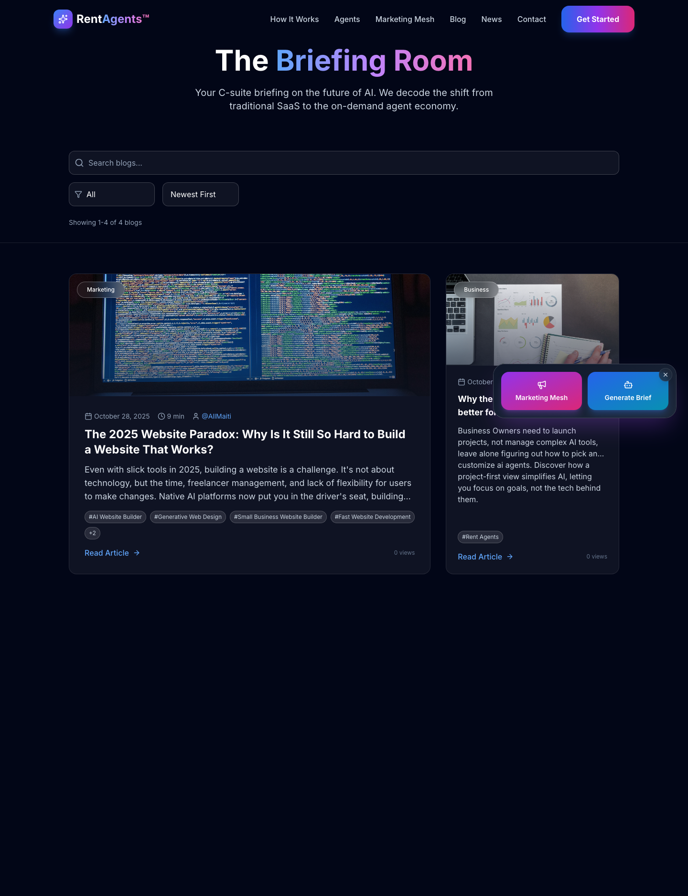

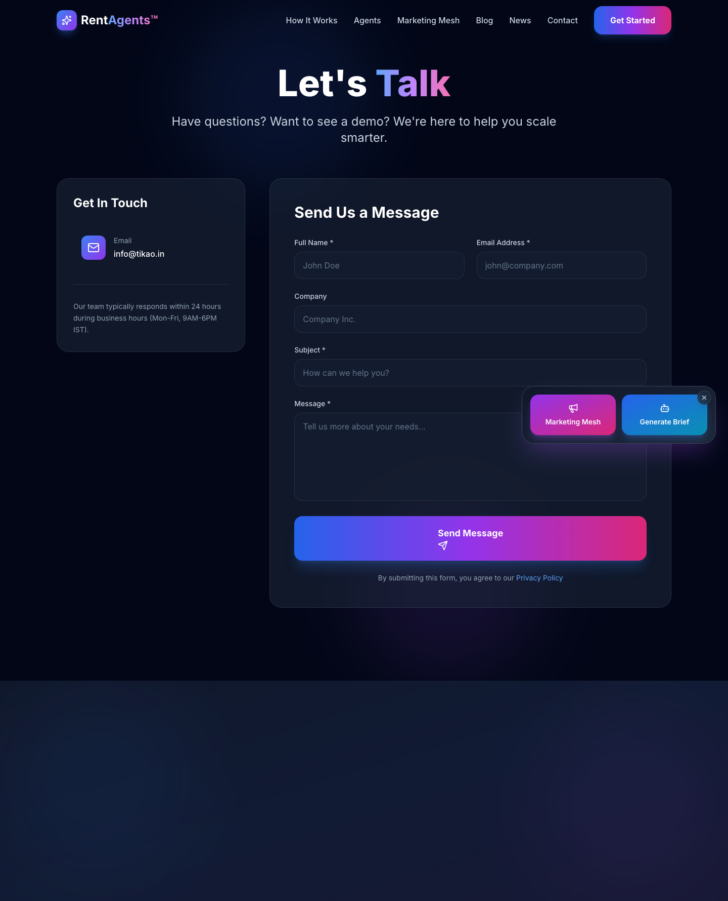

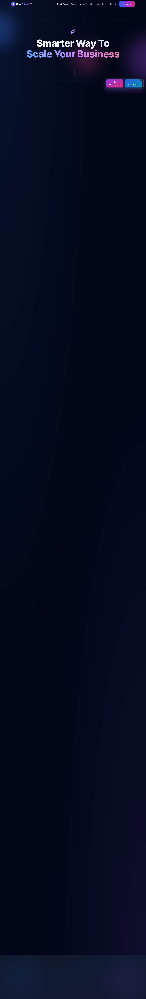

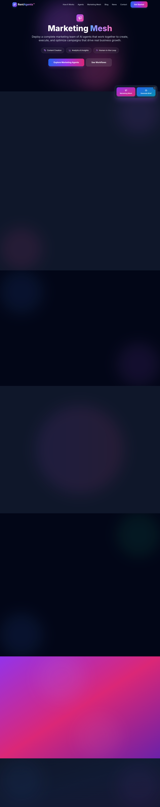

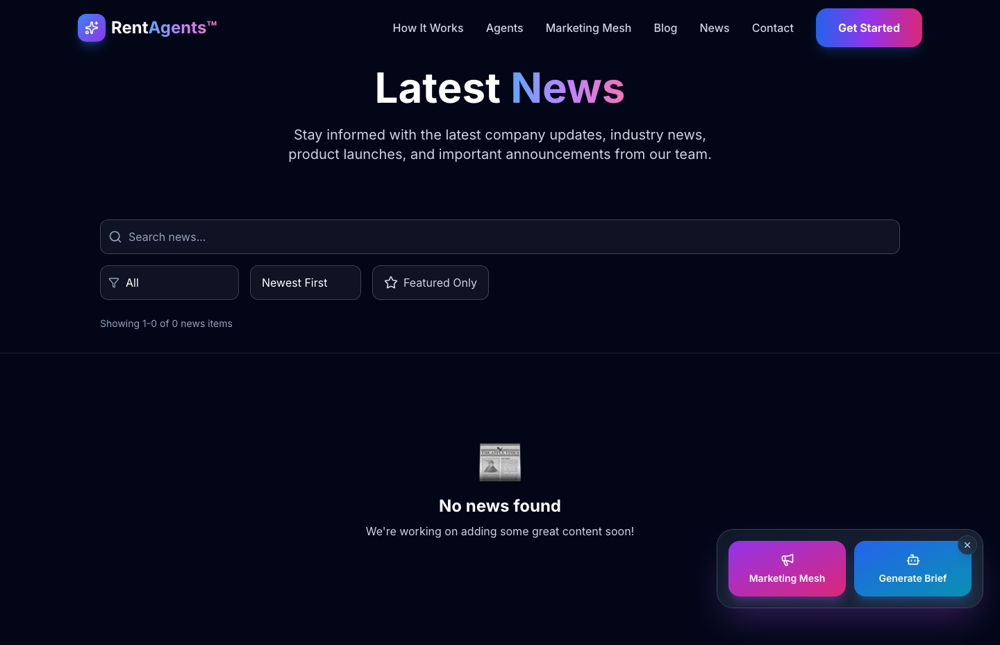

### Section Clips (screens/sections/)

*Clipped individual sections and components*

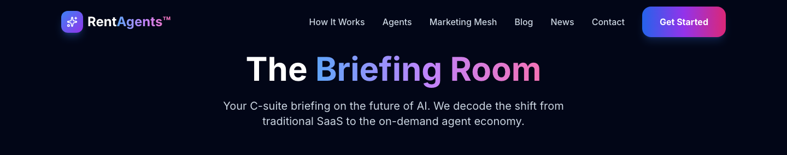

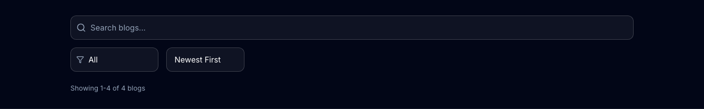

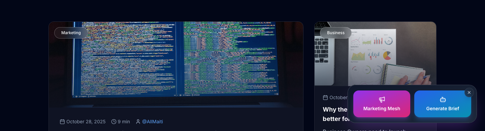

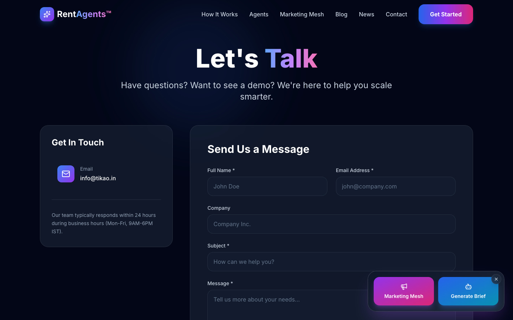

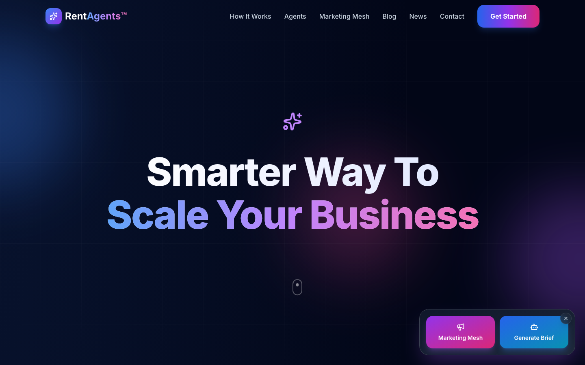

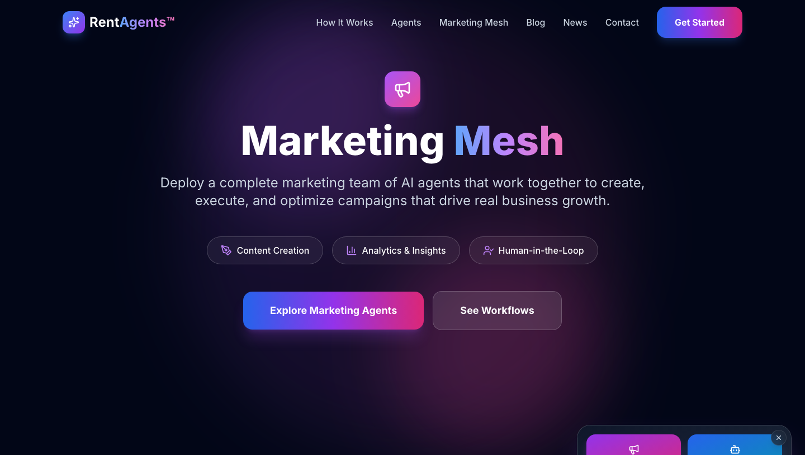


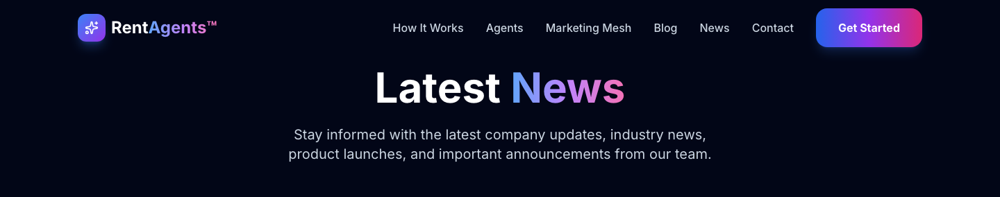

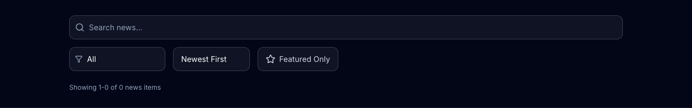

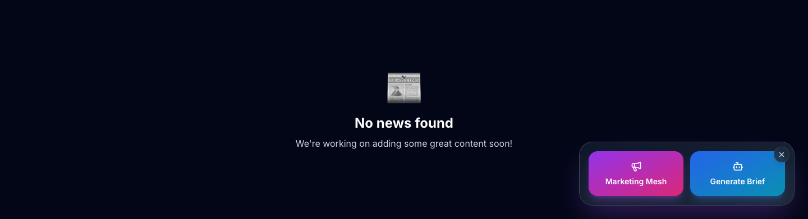

### Interaction States (screens/states/)

*Hover, focus, and active state captures*

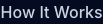


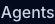


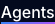


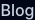


### Screenshot Index (screens/INDEX.md)

# Screenshot Index

## Scroll Journey

> Shows the cinematic state at each point of the page

| Scroll | Y Position | File |
|--------|-----------|------|
| 0% | 0px | `screens/scroll/scroll-000.png` |
| 17% | 1515px | `screens/scroll/scroll-017.png` |
| 33% | 2940px | `screens/scroll/scroll-033.png` |
| 50% | 4455px | `screens/scroll/scroll-050.png` |
| 67% | 5970px | `screens/scroll/scroll-067.png` |
| 83% | 7395px | `screens/scroll/scroll-083.png` |
| 100% | 8910px | `screens/scroll/scroll-100.png` |

## Pages

| Page | URL | File |
|------|-----|------|
| RentAgents™ - Smarter Way To Scale Your Business | `https://rentagents.ai/` | `screens/pages/home.png` |
| RentAgents™ - Smarter Way To Scale Your Business | `https://rentagents.ai/marketing-mesh` | `screens/pages/marketing-mesh.png` |
| RentAgents™ - Smarter Way To Scale Your Business | `https://rentagents.ai/blogs` | `screens/pages/blogs.png` |
| RentAgents™ - Smarter Way To Scale Your Business | `https://rentagents.ai/news` | `screens/pages/news.png` |
| RentAgents™ - Smarter Way To Scale Your Business | `https://rentagents.ai/contact` | `screens/pages/contact.png` |

## Sections

| Page | Section | File |
|------|---------|------|
| home | #1 (section) | `screens/sections/home-section-1.png` |
| marketing-mesh | #1 (section) | `screens/sections/marketing-mesh-section-1.png` |
| marketing-mesh | #2 (section) | `screens/sections/marketing-mesh-section-2.png` |
| blogs | #1 (section) | `screens/sections/blogs-section-1.png` |
| blogs | #2 (section) | `screens/sections/blogs-section-2.png` |
| blogs | #3 (section) | `screens/sections/blogs-section-3.png` |
| news | #1 (section) | `screens/sections/news-section-1.png` |
| news | #2 (section) | `screens/sections/news-section-2.png` |
| news | #3 (section) | `screens/sections/news-section-3.png` |
| contact | #1 (section) | `screens/sections/contact-section-1.png` |

## Homepage Screenshots (screenshots/)


